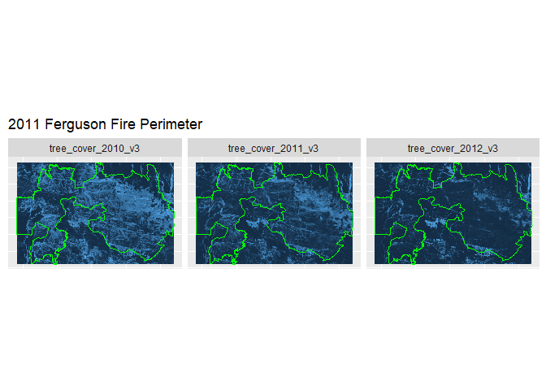
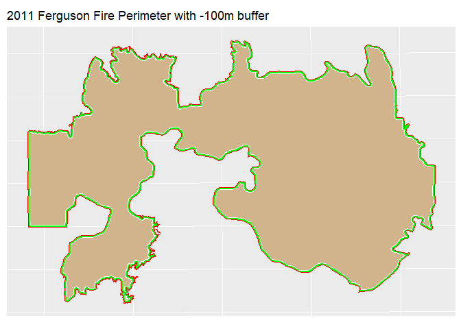
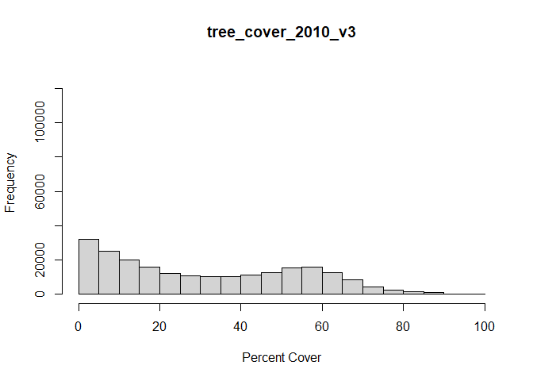
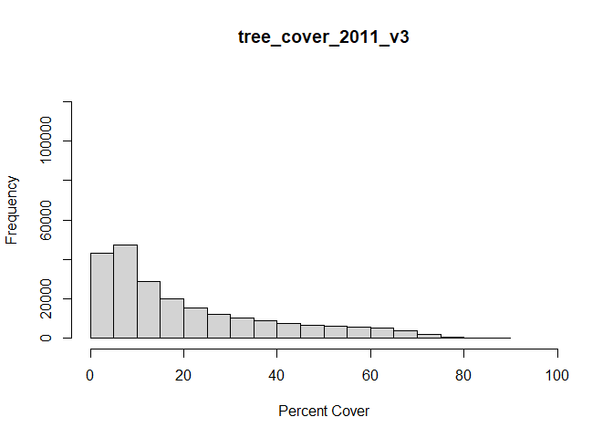
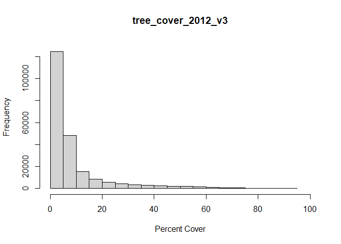
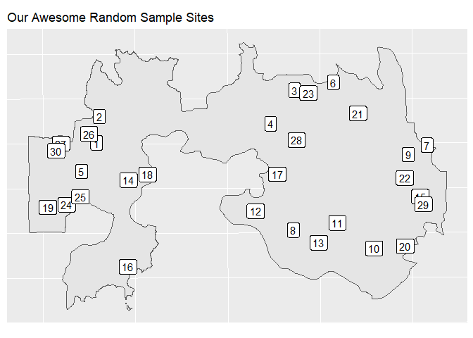
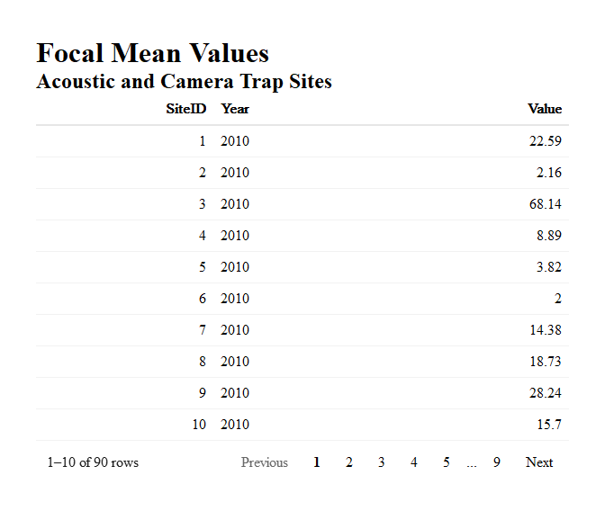

<<<<<<< HEAD
# Download, process, and extract RAP data for specific sites
=======
# Download and extract Rangeland Analysis Platform data for specific
sites
>>>>>>> 1c5a909380d6fbf825309eb399d5ed6380b057df
Mike Proctor
2025-03-19

- [Load libraries and set up folder
  paths](#load-libraries-and-set-up-folder-paths)
- [Install and load the rapr
  package](#install-and-load-the-rapr-package)
- [Download Fire Perimeter dataset from
  NIFC](#download-fire-perimeter-dataset-from-nifc)
- [Load the fire perimeter data](#load-the-fire-perimeter-data)
- [Filter data set for the Ferguson fire @ WMNWR in
  2011](#filter-data-set-for-the-ferguson-fire--wmnwr-in-2011)
- [Download RAP data](#download-rap-data)
- [Plot the RAP data just to check](#plot-the-rap-data-just-to-check)
- [Buffer the perimeter](#buffer-the-perimeter)
- [Mask RAP layers to buffer](#mask-rap-layers-to-buffer)
- [Plot the masked layers](#plot-the-masked-layers)
- [Create Histograms](#create-histograms)
- [Calculate and plot focal means for each
  layer](#calculate-and-plot-focal-means-for-each-layer)
- [Create some random sites and pretend they are acoustic or camera trap
  sites.](#create-some-random-sites-and-pretend-they-are-acoustic-or-camera-trap-sites)
- [Extract RAP based on sites](#extract-rap-based-on-sites)
- [We’ll need to rearrange the data frame a bit for the
  plot.](#well-need-to-rearrange-the-data-frame-a-bit-for-the-plot)
- [Plot a line graph of the data for all sites and
  years](#plot-a-line-graph-of-the-data-for-all-sites-and-years)

[Rangeland Analysis Platform](https://rangelands.app/)

## Load libraries and set up folder paths

Code uses rprojroot library which needs to be run within a project in
RStudio.

``` r
suppressWarnings({  # Just so we don't get a bunch of unnecessary messages on render
suppressPackageStartupMessages(library(tidyverse)) 
suppressMessages(library(rprojroot))
suppressMessages(library(sf))
suppressMessages(library(terra))
suppressMessages(library(tidyterra))
suppressMessages(library(reactable))
suppressMessages(library(reactablefmtr))
suppressMessages(library(grateful))
})

## Local stuff  =================
base_path       <- find_rstudio_root_file()                     
source_path     <- file.path(base_path, "source_data//")          
```

## Install and load the [rapr](https://humus.rocks/rapr/reference/get_rap.html) package

``` r
#remotes::install_github("brownag/rapr")
library(rapr)
```

Make sure there is a “source_data” folder within this project - where
ever you saved it locally. The following line will create one in the
correct location.

## Download Fire Perimeter [dataset](https://data-nifc.opendata.arcgis.com/datasets/5b3ff19978be49208d41a9d9a461ecfb/about) from NIFC

Save this in the “source_data” folder created above.

## Load the fire perimeter data

``` r
# There's only one layer so we don't have to specify layer name for st_read
# st_layers(paste0(source_path, 
#                  "Historic_Geomac_Perimeters_Combined_2000_2018_-7007592357689317076.gpkg"))

Fires <- st_read(paste0(source_path,
                        "Historic_Geomac_Perimeters_Combined_2000_2018_-7007592357689317076.gpkg"))
```

    Reading layer `US_HIST_FIRE_PERIMTRS_2000_2018_DD83' from data source 
      `G:\___R___\RAP\source_data\Historic_Geomac_Perimeters_Combined_2000_2018_-7007592357689317076.gpkg' 
      using driver `GPKG'

    Warning in CPL_read_ogr(dsn, layer, query, as.character(options), quiet, : GDAL
    Message 1: Non-conformant content for record 1 in column datecurrent,
    2018-02-14T00:00:00.0Z, successfully parsed

    Simple feature collection with 23776 features and 20 fields
    Geometry type: MULTIPOLYGON
    Dimension:     XY
    Bounding box:  xmin: -19908540 ymin: 377194.8 xmax: -7272854 ymax: 11120720
    Projected CRS: WGS 84 / Pseudo-Mercator

## Filter data set for the Ferguson fire @ WMNWR in 2011

[Firefighters Have Comanche County Wildfires Under
Control](https://www.news9.com/story/5e35b03683eff40362bec4d4/firefighters-have-comanche-county-wildfires-under-control)

[Two construction companies fined for Wichita Mountains
fire](https://www.oklahoman.com/story/business/local/2016/07/30/two-construction-companies-fined-for-wichita-mountains-fire/60660143007/)

[Performance of Burn-Severity Metrics and Classification in Oak
Woodlands and
Grasslands](https://www.researchgate.net/publication/281408533_Performance_of_Burn-Severity_Metrics_and_Classification_in_Oak_Woodlands_and_Grasslands)

``` r
Ferguson <- Fires |> filter(incidentname == "Ferguson" & state == "OK")

Ferguson <- sf::st_transform(Ferguson, crs = 4326) # Set crs so it lines up with RAP
#st_crs(Ferguson)
```

## Download RAP data

The get_rap() function calculates the extent of the polygon (Ferguson)
and uses that as an AOI.

Plot the rap layers along with the Ferguson perimeter to make sure they
land right - no crs issues. Downloads all of the cover layers but
filters to only the tree cover layers

``` r
# Turn this off after running the first time so you don't spam the server
res <- get_rap(
  Ferguson, # creates a bounding box of this polygon - you can specify a bounding box directly - see docs
  version = "v3",
  years = c(2010:2012),
#  filename = "RAP.tif",
  product = "vegetation-cover", # other option here is "vegetation-biomass"
  progress = FALSE
)

#st_crs(res) # check crs 
```

## Plot the RAP data just to check

You can already see some differences between the years.

``` r
#Layers <- names(res)# This gets the name of the indexed layer https://rspatial.github.io/terra/reference/as.list.html
Layers <- as.data.frame(names(res)) |> 
          filter(str_detect(names(res), "^tree")) # only interested in the tree layers

for (i in Layers) {
  
  #This loops through all of the layers 
  spatter <- res |> tidyterra::select(all_of(i))# https://dieghernan.github.io/tidyterra/index.html

    # Parse out parts of layer names 
  category <- str_extract(i, "[a-z]+")
  stat <- str_extract(i, "[a-z]+_[0-9]+_[a-z][0-9]+$") |> str_extract("[a-z]+")
  layerdate <- str_extract(i, "[0-9]+") |> str_remove("_")
  
    plot_name <- 
  ggplot() +
  tidyterra::geom_spatraster(data = spatter) +
  ggplot2::geom_sf(data = Ferguson, color = "green", fill = "transparent") +
  theme(legend.position = "none",
        axis.title.x = element_blank(),
        axis.text.x  = element_blank(),
        axis.ticks.x = element_blank(),
        axis.text.y  = element_blank(),
        axis.ticks.y = element_blank()) +
  ggtitle("2011 Ferguson Fire Perimeter") +
      facet_wrap(~lyr)

print(plot_name)
  
  
}
```



## Buffer the perimeter

Used -100m to avoid edge effects from roads, firebreaks etc. If I were
working with movement data(GPS collars) of animals, I’d probably use a
positive number and consider movement range or territory size to sort
out what value to use. If the buffer is larger than the original
polygon, use it in the first argument in get_rap() instead of the
original. In reality -100m is probably too much but it makes it easier
to see the buffer when plotting at this scale. The red line is the
original Ferguson perimeter, the tan is the buffered perimeter, and the
green is the difference between the two - what we buffered out.



## Mask RAP layers to buffer

``` r
reProSpatter <- project(spatter, "EPSG:32614") # Has to match the polygon we're using for the mask
# st_crs(rapRaster)
# st_crs(Ferguson)

#names(reProSpatter)
layerList <- list()
for (k in names(reProSpatter)) {
  
maskedRap <- mask(reProSpatter[[k]]
     , Ferguson_buffered_100
     , inverse = FALSE
     , updatevalue = NA
     , touches = TRUE
    # , filename=paste0(plot_path, k, ".tif")
     )
df <- maskedRap

df_name <- paste(k)

assign(df_name, df, envir = .GlobalEnv) # Save individual layers to environment

layerList[[k]] <- df_name # Create a list of the layer names while we're at it

}
```

## Plot the masked layers

``` r
for (z in layerList) {

plot_name <- 
  ggplot() +
  geom_spatraster(data = get(z)) + # layers are coming from the environment now
  scale_fill_viridis_c( na.value = "transparent", limits = c(NA, 100)) +
  theme(#legend.position = "none",
        axis.title.x    = element_blank(),
        axis.text.x     = element_blank(),
        axis.ticks.x    = element_blank(),
        axis.text.y     = element_blank(),
        axis.ticks.y    = element_blank()) +
    labs(
    fill = "",
    title = paste0("Ferguson Fire 2011"),
    subtitle = z
  )
print(plot_name)  
}
```


## Create Histograms

We can definitely see some changes between years now.

``` r
for (y in layerList) {
  
hist(get(y)
     ,plot = TRUE
     , xlim = c(0,100)
     , ylim = c(0,130000)
     , xlab = "Percent Cover")

}
```







## Calculate and plot focal means for each layer

Calculating the mean across a 15X15 matrix and storing that value in the
middle pixel of that matrix. The resolution of the imagery comes into
play here - RAP has 30m resolution so a 15X15 matrix represents a
450mX450 area on the ground. Size and mobility/territoriality of a
target organism might influence the choice of matrix size as well. I
chose 15X15 just for dramatic effect - makes it easier to see the
change.

``` r
focalities <- list()
for (n in layerList) {
  
  focalities[[n]] <- 
    focal(
      get(n),
      w = matrix(1, nrow = 15, ncol = 15),
      #w = matrix(1, nrow = 3, ncol = 3),
      fun = mean,
      na.rm = FALSE)
  
  plot_name <- # We're plotting as we calculate the focal mean for each layer
  ggplot() +
  #geom_spatraster(data = get(n)) +
  geom_spatraster(data = focalities[[n]]) +
  scale_fill_viridis_c( na.value = "transparent", limits = c(NA, 100)) +
  theme(#legend.position = "none",
        axis.title.x    = element_blank(),
        axis.text.x     = element_blank(),
        axis.ticks.x    = element_blank(),
        axis.text.y     = element_blank(),
        axis.ticks.y    = element_blank()) +
    labs(
    fill = "",
    title = n,
    subtitle = "Focal Mean"
        )
  
print(plot_name)  
}
```


## Create some random sites and pretend they are acoustic or camera trap sites.

``` r
set.seed(67) # What happens if this isn't set or set to something different?
RandomSampleSites <- st_sample(Ferguson_buffered_100, size = 30, type = "random")

# Converts to an sf object and adds SiteID column
RandomSampleSites <- st_as_sf(RandomSampleSites) |> mutate("SiteID" = row_number())
  
  plot_name <- 
  ggplot() +
  geom_spatvector(data = Ferguson_buffered_100) +
  geom_spatvector_label(data = RandomSampleSites, aes(label = SiteID)) +
      theme(#legend.position = "none",
        axis.title.x    = element_blank(),
        axis.text.x     = element_blank(),
        axis.ticks.x    = element_blank(),
        axis.title.y    = element_blank(),
        axis.text.y     = element_blank(),
        axis.ticks.y    = element_blank()) +
    labs(
    fill = "",
    title = "Our Awesome Random Sample Sites",
    #subtitle = "Focal Mean"
        )
  
print(plot_name) 
```



## Extract RAP based on sites

``` r
Focal_df <- list() # create an empty list
for (p in layerList) {

Focal_df[[p]] <- # add a data frame to list on each loop
  round( 
  extract(              # we end up with a list of data frames
    get(p), 
    RandomSampleSites)
  ,2)

}
Focal_df <- bind_rows(Focal_df) |> # converts from a list to a single data frame
            rename("SiteID" = "ID")
```

## We’ll need to rearrange the data frame a bit for the plot.

First we’ll pivot the year and focal mean value into two columns then
we’ll clean up the data in the year column so that it only has the year.

``` r
Focal_pivot <- Focal_df |> pivot_longer(c(2:4), names_to = "Year", values_to = "Value", values_drop_na = TRUE)

# Focal_separate <- Focal_pivot |> 
#   separate_wider_delim(Year, # Just to show what is going on - we're really just after "Year"
#                        names = c("tree", "cover", "Year", "version"),
#                        delim = "_")

Focal_separate <- Focal_pivot |> 
  separate_wider_delim(Year, # Remove the extra columns in one go
                       names = c(NA, NA, "Year", NA), 
                       delim = "_"
                       #,too_many = "debug"
                       )

reactable(Focal_separate) |> add_title(title = "Focal Mean Values") |> 
  add_subtitle((subtitle = "Acoustic and Camera Trap Sites"))
```



## Plot a line graph of the data for all sites and years

There’s an obvious decline in woody cover over our study period although
some weird stuff is happening in 2011 - the year of the fire. Why? Quite
a lot of things could be causing problems. Were this earlier in the
season with higher precipitation some of those large oaks could have
leafed back out and new leaves might have fooled the sensors into
reporting greener values than were the case. Trees often die over an
extended period of time when stressed by fire - some of the those trees
were dead, they just didn’t know it yet. Fire intensity is likely a
factor in how stressed a tree gets, so may influence how fast they die.
If those factors don’t confuse issues enough, we should consider how the
data gets collected. RAP data incorporates multiple imagery passes as
well as physical “on the ground” vegetation sampling. These occur over
time and can’t really be sorted out from a single image. Some may have
occurred prior to the fire and others afterward. So how do we deal with
the 2011 data? You’re research question is likely to be something to the
effect of “What is the response of”X” to the fire?“, so you really just
need to know what the conditions were prior to the fire versus after -
you may not need to fool with the 2011 data.

``` r
Focal_separate$SiteID <- as.factor(
                        as.character(Focal_separate$SiteID)
                        ) # changes ID to character to use for labels

#levels(Focal_separate$SiteID)
Focal_separate$SiteID <- factor(Focal_separate$SiteID, levels = c(1:30)) # ordering ID for plot

plot_name<- 
  ggplot(Focal_separate) +
  #geom_point() +
  geom_line(aes(Year, Value, group = SiteID, col = SiteID)) +
  scale_color_viridis_d() +
  ylab("Percent Cover") +
  #theme(legend.position = "none") +
  labs(
    fill = "",
    title = "Percent Tree Cover by Year Based on RAP data",
    subtitle = "2011 Ferguson Fire"
  )

print(plot_name)  
```


``` r
pkgs <- cite_packages(output = "table", out.dir = ".")
knitr::kable(pkgs)
```

| Package | Version | Citation |
|:---|:---|:---|
| base | 4.4.2 | R Core Team (2024) |
| knitr | 1.49 | Xie (2014); Xie (2015); Xie (2024) |
| rapr | 0.1.2 | Robinson et al. (2019); Jones et al. (2021); Allred et al. (2021); Brown (n.d.) |
| reactable | 0.4.4 | Lin (2023) |
| reactablefmtr | 2.0.0 | Cuilla (2022) |
| rmarkdown | 2.29 | Xie, Allaire, and Grolemund (2018); Xie, Dervieux, and Riederer (2020); Allaire et al. (2024) |
| rprojroot | 2.0.4 | Müller (2023) |
| sf | 1.0.19 | Pebesma (2018); Pebesma and Bivand (2023) |
| terra | 1.8.29 | Hijmans (2025) |
| tidyterra | 0.7.0 | Hernangómez (2023) |
| tidyverse | 2.0.0 | Wickham et al. (2019) |

<div id="refs" class="references csl-bib-body hanging-indent"
entry-spacing="0">

<div id="ref-rmarkdown2024" class="csl-entry">

Allaire, JJ, Yihui Xie, Christophe Dervieux, Jonathan McPherson, Javier
Luraschi, Kevin Ushey, Aron Atkins, et al. 2024.
*<span class="nocase">rmarkdown</span>: Dynamic Documents for r*.
<https://github.com/rstudio/rmarkdown>.

</div>

<div id="ref-rapr2021d" class="csl-entry">

Allred, B. W., B. T. Bestelmeyer, C. S. Boyd, C. Brown, K. W. Davies, L.
M. Ellsworth, et al. 2021. “Improving Landsat Predictions of Rangeland
Fractional Cover with Multitask Learning and Uncertainty. Methods in
Ecology and Evolution.” *Methods in Ecology and Evolution.*
<http://dx.doi.org/10.1111/2041-210x.13564>.

</div>

<div id="ref-rapra" class="csl-entry">

Brown, Andrew. n.d. *<span class="nocase">rapr</span>: Interface to
Rangeland Analysis Platform (RAP) Vegetation Biomass and Cover
Products*. <http://github.com/brownag/rapr>.

</div>

<div id="ref-reactablefmtr" class="csl-entry">

Cuilla, Kyle. 2022. *<span class="nocase">reactablefmtr</span>:
Streamlined Table Styling and Formatting for Reactable*.
<https://CRAN.R-project.org/package=reactablefmtr>.

</div>

<div id="ref-R-tidyterra" class="csl-entry">

Hernangómez, Diego. 2023. “Using the
<span class="nocase">tidyverse</span> with
<span class="nocase">terra</span> Objects: The
<span class="nocase">tidyterra</span> Package.” *Journal of Open Source
Software* 8 (91): 5751. <https://doi.org/10.21105/joss.05751>.

</div>

<div id="ref-terra" class="csl-entry">

Hijmans, Robert J. 2025. *<span class="nocase">terra</span>: Spatial
Data Analysis*. <https://CRAN.R-project.org/package=terra>.

</div>

<div id="ref-rapr2021b" class="csl-entry">

Jones, M.O., N. P. Robinson, D. E. Naugle, J. D. Maestas, M. C. Reeves,
R. W. Lankston, and B. W. Allred. 2021. “Annual and 16-Day Rangeland
Production Estimates for the Western United States.” *Rangeland Ecology
& Management* 77: 112–17.
<http://dx.doi.org/10.1016/j.rama.2021.04.003>.

</div>

<div id="ref-reactable" class="csl-entry">

Lin, Greg. 2023. *<span class="nocase">reactable</span>: Interactive
Data Tables for r*. <https://CRAN.R-project.org/package=reactable>.

</div>

<div id="ref-rprojroot" class="csl-entry">

Müller, Kirill. 2023. *<span class="nocase">rprojroot</span>: Finding
Files in Project Subdirectories*.
<https://CRAN.R-project.org/package=rprojroot>.

</div>

<div id="ref-sf2018" class="csl-entry">

Pebesma, Edzer. 2018. “<span class="nocase">Simple Features for R:
Standardized Support for Spatial Vector Data</span>.” *The R Journal* 10
(1): 439–46. <https://doi.org/10.32614/RJ-2018-009>.

</div>

<div id="ref-sf2023" class="csl-entry">

Pebesma, Edzer, and Roger Bivand. 2023. *<span class="nocase">Spatial
Data Science: With applications in R</span>*. Chapman and Hall/CRC.
<https://doi.org/10.1201/9780429459016>.

</div>

<div id="ref-base" class="csl-entry">

R Core Team. 2024. *R: A Language and Environment for Statistical
Computing*. Vienna, Austria: R Foundation for Statistical Computing.
<https://www.R-project.org/>.

</div>

<div id="ref-rapr2019c" class="csl-entry">

Robinson, N. P., M. O. Jones, A. Moreno, T. A. Erickson, D. E. Naugle,
and B. W. Allred. 2019. “Rangeland Productivity Partitioned to Sub-Pixel
Plant Functional Types.” *Remote Sensing* 11 (1427).
<http://dx.doi.org/10.3390/rs11121427>.

</div>

<div id="ref-tidyverse" class="csl-entry">

Wickham, Hadley, Mara Averick, Jennifer Bryan, Winston Chang, Lucy
D’Agostino McGowan, Romain François, Garrett Grolemund, et al. 2019.
“Welcome to the <span class="nocase">tidyverse</span>.” *Journal of Open
Source Software* 4 (43): 1686. <https://doi.org/10.21105/joss.01686>.

</div>

<div id="ref-knitr2014" class="csl-entry">

Xie, Yihui. 2014. “<span class="nocase">knitr</span>: A Comprehensive
Tool for Reproducible Research in R.” In *Implementing Reproducible
Computational Research*, edited by Victoria Stodden, Friedrich Leisch,
and Roger D. Peng. Chapman; Hall/CRC.

</div>

<div id="ref-knitr2015" class="csl-entry">

———. 2015. *Dynamic Documents with R and Knitr*. 2nd ed. Boca Raton,
Florida: Chapman; Hall/CRC. <https://yihui.org/knitr/>.

</div>

<div id="ref-knitr2024" class="csl-entry">

———. 2024. *<span class="nocase">knitr</span>: A General-Purpose Package
for Dynamic Report Generation in r*. <https://yihui.org/knitr/>.

</div>

<div id="ref-rmarkdown2018" class="csl-entry">

Xie, Yihui, J. J. Allaire, and Garrett Grolemund. 2018. *R Markdown: The
Definitive Guide*. Boca Raton, Florida: Chapman; Hall/CRC.
<https://bookdown.org/yihui/rmarkdown>.

</div>

<div id="ref-rmarkdown2020" class="csl-entry">

Xie, Yihui, Christophe Dervieux, and Emily Riederer. 2020. *R Markdown
Cookbook*. Boca Raton, Florida: Chapman; Hall/CRC.
<https://bookdown.org/yihui/rmarkdown-cookbook>.

</div>

</div>
